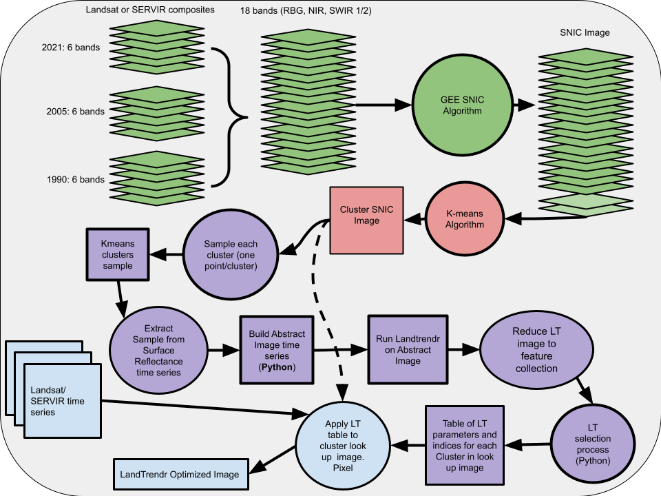

General setup instructions
==========================
This document outlines the overall workflow for running a version of LTOP that is (mostly) based on five GEE steps. Note that this version of the algorithm and the associated documentation has been updated to run in the GEE Python API and requires less input from the user than the original implementation. This is still a work in progress and will likely evolve in future versions. The way this is set up currently, you will run a Python script which will execute (almost) all of the steps in the workflow. It will generate intermediate outputs to a GEE assets directory of your choosing. Most of the steps are set up to 'wait' for the previous step to finish before initiating. 

The workflow assumes some understanding of running scripts in GEE, generating jobs and exporting 
assets or files to gDrive. The approach also assumes some understanding of Python and how to at 
least run a Python script in an IDE or from the command line. We start by outlining some of the 
background for the process, some information on the general overview of the workflow and how this 
could be set up for somebody to actually run. We then go through the steps to produce LTOP output,
how the outputs can be assessed and then some of the pitfalls one might run into while carrying 
out this workflow. Note that to produce temporally stabilized outputs of an existing time series 
see the SERVIR_stabilization `GitHub repository <https://github.com/eMapR/SERVIR_stabilization>`_. 

`General overview of theory and background <https://docs.google.com/presentation/d/1ra8y7F6_vyresNPbT3kYamVPyxWSfzAm7hCMc6w8N-M/edit?usp=sharing>`_
 

**Important**

Before starting, there are a few things you must do. The first and most important is to update the params.py 
file according to the directions laid out above. The second crucial element is to set up the necessary components for GCS. 

Instructions for setting up GCS: 
NOTE that if you are a regular user of GCS and already have projects/buckets created you can likely skip this step or amend how the code is working to suite your needs. This is meant to be a starter for those who have not used GCS before.    

1. Create or check to see that you have a `GCS account <https://cloud.google.com/gcp?utm_source=google&utm_medium=cpc&utm_campaign=na-US-all-en-dr-bkws-all-all-trial-e-dr-1011347&utm_content=text-ad-none-any-DEV_c-CRE_622022396323-ADGP_Desk%20%7C%20BKWS%20-%20EXA%20%7C%20Txt%20~%20Google%20Cloud%20Platform%20Core-KWID_43700073027148699-kwd-6458750523&utm_term=KW_google%20cloud-ST_google%20cloud&gclid=Cj0KCQjwnbmaBhD-ARIsAGTPcfXFH3iizzepFJ4jBJwrT_T5t2HBrNZed5qcdRsU6FgZZ7oxvDTGKF8aAvjAEALw_wcB&gclsrc=aw.ds>`_

2. Install the google-cloud-storage python module. Follow `these directions <https://cloud.google.com/sdk/docs/install>`_ to install the google cloud sdk. 

3. Create a service account and associated key: `directions <https://cloud.google.com/resource-manager/docs/creating-managing-projects>`_. The workflow expects a key called 'creds.json'. This should be stored in the same directory as the scripts you are running. If there is another way you want to do this some changes will have to be made in the code.

4. Create a GCS `cloud bucket <https://cloud.google.com/storage/docs/creating-buckets>`_. Note that if you have no projects you should create a new `project <https://cloud.google.com/resource-manager/docs/creating-managing-projects>`_ to hold the bucket. 

5. Change the params to reflect your cloud bucket name. 